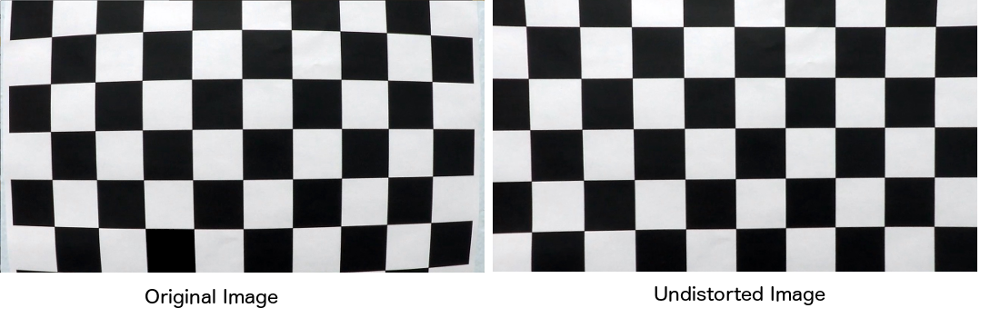
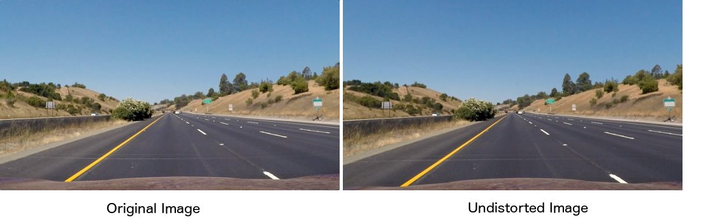
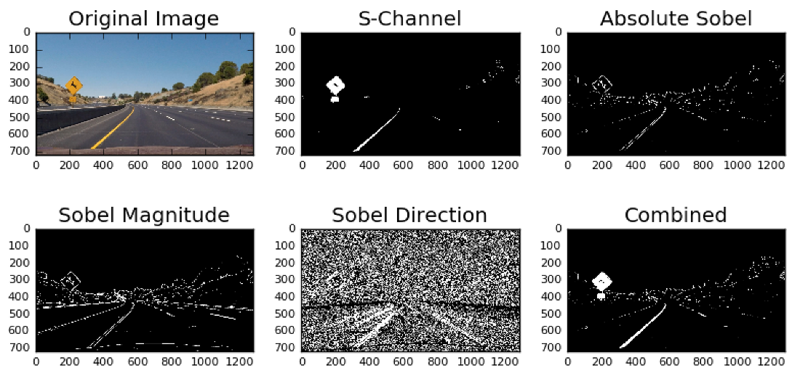
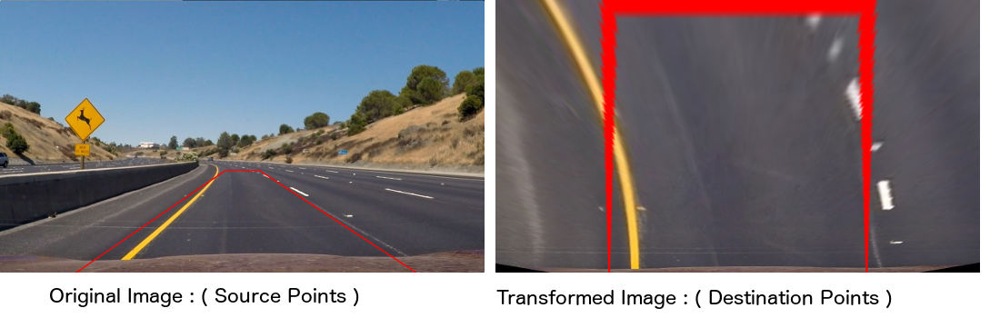
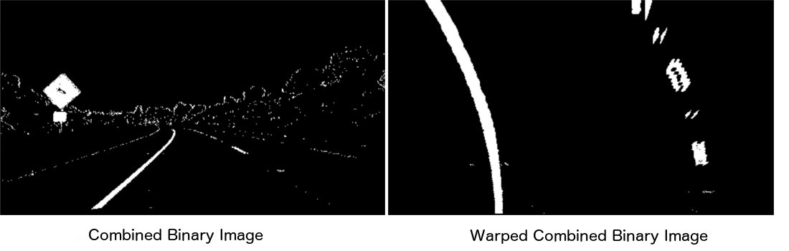
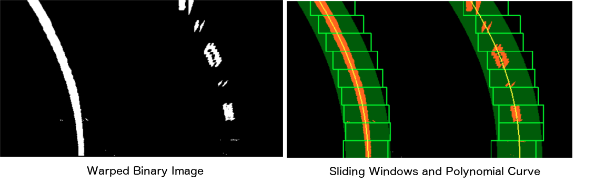
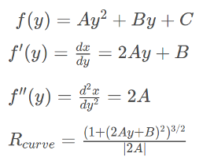
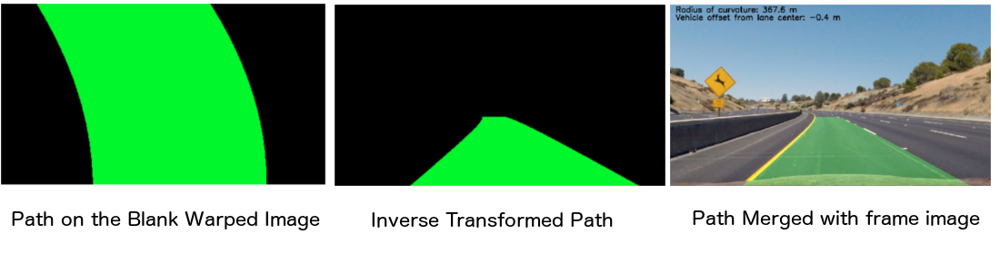
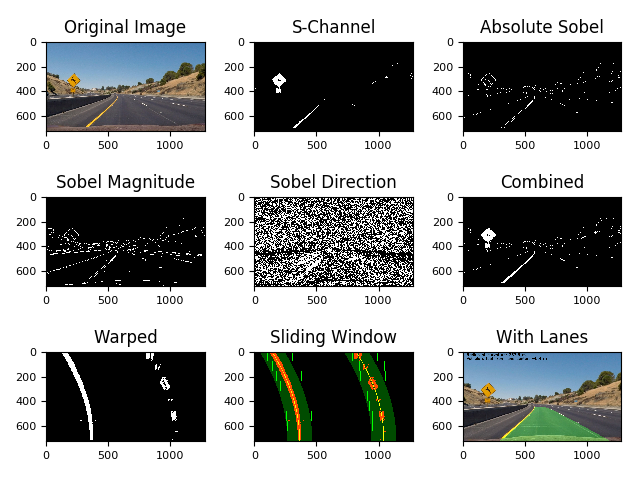
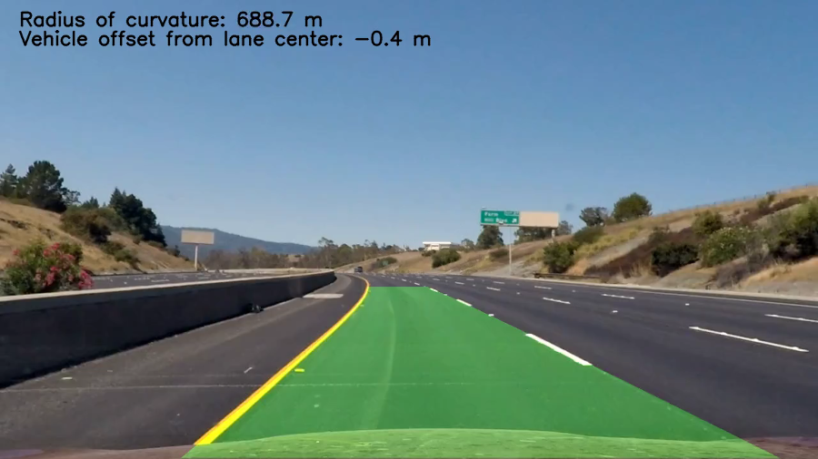

# **Advanced Lane Finding**

This project aims to get an understanding of the lane tracking mechanisms from a computer vision perspective using the camera video feed.The objective is to detect the lane , and calculate the curvature and the car position relative to the lane.

The files `pipeline_image_test.py` , `pipeline_video_test.py` drive the pipeline for an image and the video.

# **Project Goals**

1. Camera Calibration and Distortion Correction
2. Color and gradient thresholding
3. Perspective Transform
4. Lane points detection and fitting
5. Calculation of Curvature and Offset
6. Drawing Lane and Information


# **Camera Calibration and Distortion Correction**

The task of camera calibration is to determine the parameters of the transformation between an object in 3D space and the image observed by the camera from visual perspective.

All the chessboard images from the camera_cal folder are used to determine the camera matrix and the distortion coefficients that would be used whenever we have to undistort the images. The camera Matrix is the relationship between the coordinates of the points relative to the camera in 3D space and position of that point on the image in pixels.

```python
# camera.py
def calibrate(self):
    # cv2.findChessboardCorners is used for finding chessboard corners
    # cv2.calibrateCamera is used for camera calibration

```

In the above function object_points contain the (x,y,z) coordinates of the chessboard in a 3D space and image_points will contain the (x,y) pixel position of the chessboard corners obtained using the `cv2.findChessboardCorners()` function. These collection of points from all the chessboard images are passed to the `cv2.calibrateCamera()` function to get the Camera Matrix and the Distortion Coefficients.



Undistortion on the video frame image will not look as obvious to the eye but technically the distortions get rectified.




# **Color and Gradient thresholding**

We apply various color and gradient thresholding to detect the lane edges and create a binary image. Detecting the lanes is not easy using a single color map since the image have both yellow and while lane colors, also there will be certain lighting changes,  shadows etc. We will have to use more than one color space to get the lane edges. 

I have used S-Channel of HSL color map as it gave good detection of lane edges for the yellow lines. Finding the thresholds has been a trial and error process

Similarly I used the Sobel operators for the gradient thresholding to detect the other edges in the image. It is a derivative, such that if the difference in color between two points is very high, the derivative will be high. We compare neighboring points in the given kernel size.

I finally combined all the binary images obtained from the Sobel operator, S-channel to get one binary image with edges.

I did experiment with a lot of color spaces and combinations and saw that we can use other color maps with good thresholding parameters that gave good results as well.

```python
# image_processor.py
def process_sobel_absolute(pv):
    # applies sobel-x operator on the image
    # Stores the images in img_sobel_magnitude

def process_sobel_magnitude(pv):
    # applies sobel-x.sobel-y operator on the image
    #calculates magnitude ans stores the image in img_sobel_magnitude

def process_sobel_direction(pv):
    # applies sobel-x.sobel-y operator on the image
    #calculates direction ans stores the image in img_sobel_direction

def process_schannel(pv):
    # Applies thresholding on the s channel of the HLS colormap image
    #store sthe binary thresholded image in img_schannel_binary

def process_combined(pv):
    # combines all the previous binary images.
    pv.img_combined_binary = np.zeros_like(pv.img_sobel_binary)
    pv.img_combined_binary[( pv.img_sobel_binary == 1 | \
     ((pv.img_sobel_magnitude == 1) & (pv.img_sobel_direction == 1))) | pv.img_schannel_binary == 1] = 1

```




# **Perspective Transform**

Perspective transform is a process on the image to get a birds-eye view of the lane ahead. I have taken a fixed points in the image to create a trapezium and then called the getPerspectiveTransform() function to get 2 matrices for both the transformation and the inverse transformation. Using the transformation matrix, we can convert an image into a bird&#39;s eye view by calling the warpPerspective() function. It makes more sense to fit a curve on the lane from this point of view, and then unwarp using the inverse transformation matrix to return to the original view.

I have used hard coded values as below for the transformation.

|Source	|Dest|
|-------|:---|
|200, 720|	300, 720|
|1100, 720|	980 , 720|
|595, 450|	300, 0|
|685, 450|	980, 0|
|

```python
# image_processor.py
def perspective_transform(pv):
    #applies the perspective transform using the below coordinates
    src = np.float32([[200, 720],[1100, 720],[595, 450],[685, 450]])
    dst = np.float32([[300, 720],[980 , 720],[300, 0  ],[980, 0  ]])
    pv.transform_matrix= cv2.getPerspectiveTransform(src, dst)
    pv.inverse_matrix = cv2.getPerspectiveTransform(dst, src)
    pv.img_warped_binary = cv2.warpPerspective(pv.img_combined_binary, pv.transform_matrix, img_size, flags=cv2.INTER_LINEAR)
    
```
**Transformation on the actual image**


<br>
**Transformation on the binary image**



# **Lane points detection and fitting**

We will use the warped binary image to detect the lane points. It would not much sense to search for the points in the whole image as we know that the lane points would be present at specific areas on the warped binary image. We take a histogram of the bottom half  of the warped binary image. The peaks of the histogram will serve as a guideline on where the lanes start in the x-axis . We will start doing a search for the lane points using a small window and sliding it from bottom to the top and adjusting it basing on the mean of the points detected in the window. We will end up with a set of points that approximately represent the lane.

```python
#lane_detector.py
def find_lane_points(pv):
    #Finds the points for the left and right edges of the lane by calling the sliding window on the warped binary image

def sliding_window(nz_points,base_x):
    # Applies the sliding window logic on the starting from a give base_x position
    # returns the coordinates of the sliding windows
```

Since it would be a curved lane, it makes sense for a second order polynomial to be used to fit the lane `x = ay^2 + by + c`. We now fit a  polynomial curve to the identified pixels.Once we have the polynomial , we can predict the x,y points needed for drawing the curve.

```python
#lane_detector.py
def fit_lane_points(nz_points):
    # uses the lane points identified using the sliding window logic and tries to fit a 2nd order polynomial
    # it does this fitting for both the left and the right edges of the lane

def generate_plot_points(pv):
    # uses the polynomial fit from the fit_lane_points() function .
    # generates the plotting points using the polynomial and the y axis linespace


```

**Sliding window**


We can find the lane pixels on consecutive frames of a video by searching nearby the identified polynomial curve, but I did the whole search in each frame to keep it simple. I however did use the points identified across the frames to average the polynomial to get a smooth curve.

# **Calculation of Radius of Curvature and Offset**

Raduis of curvature of the lane is an important parameter for self driving cars since it would determine the steering angle of the vehicle. The calculation of the radius of curvature is done for both the lane edges and then the mean is taken.  Radius of curvature is given by the formula as below.



The vehicle position is calculated as the difference between the image center and the lane center.The conversion from the image measurements in pixels to the real world measurements of meters is done using the below 

30/720 # meters per pixel in y dimension

3.7/700 # meters per pixel in x dimension

```python
# lane_detector.py
def calculate_curve(pv):
    # This calculates the radius of the curvature using 
    # 1) the points identified in the sliding window
    # 2) pixels to meters ratio
    # 3) Radius of curvature equation
    # left and right curvatures are calculated and averaged.

def calculate_vehicle_offset(pv):
    #This calculates the vehicle offset from the center of the lane

```

# **Drawing Lane and Information**

 The plotting points from the `generate_plot_points()` will be used to create an array of points representing a polygon. This array of points is passed to the `fillPoly()` function to draw a filled polygon on a blank image of the size of the warped binary image. We then apply an inverse transform on this to convert it from a bird's eye view to the real world view and then merge it with the actual image using the `addWeighted()` function.

```python
# image_processor.py
def draw_overlay(pv):
    # Draws a filled polygon on blank image of warped binary size 
    # unwarps and merges with the frame image
```
 

# **The pipeline review**
The pipeline for processing of the image in one view.
 

# **Final Video**

[](https://youtu.be/xww0xHwjxdY)

[https://youtu.be/xww0xHwjxdY](https://youtu.be/xww0xHwjxdY)

# **Discussion : Problems/Issues &amp; Improvements**
- Detection of lanes in the varying lighting conditions and shadows is the key for a successful lane detection.I am working on enhancing the pipeline with channels of other color maps (eg. LAB) to eliminate the issues caused by the shadows and lighting conditions.
- Finding the optimal thresolds would be the key. It has been a trial and error method. 
- I am experimenting to come up with an automated thresholding and colormap selection process. This process will first identify the optimal colormap to be used basing on the lighting condition in the image. And then the rest of the pipeline with follow. It's like the system is dynamically switching the color maps depending on the lighting conditions.
- Speed is always an issue with the image processing applications. Using a GPU and in C/C++ language for these would definitely make this realtime.
- I will also try to work on a solution based on machine learning to identify the lanes. We could feed a set of 64x64 images with lanes to train a classifier. We can then do a sliding window on the image with a 64x64 pixels window to identify the blocks that could contain lanes.
- I am working on refining my pipeline to pass it for the 2 challange videos. Due to time issue , I am submitting my project for now.